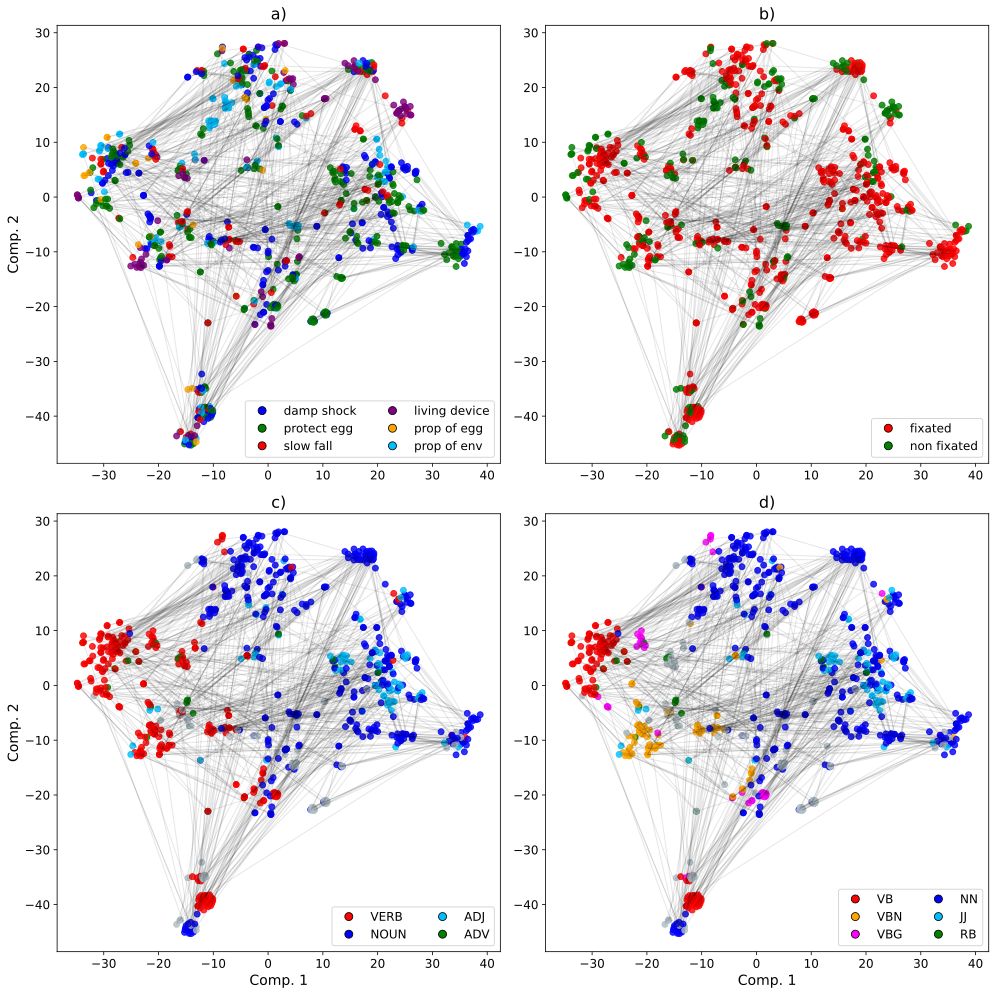

# Rethinking Design Fixation in LLMs: A Process-Based Perspective Toward Linguistic Fixation 

This folder contains the final hidden-state representations for the egg-task experiment conducted for the DCC26 Conference paper. Specifically, you can access the interactive visualization of Figure 3.

**Fig. 3** Two-dimensional projection of the 4096-dimensional hidden states obtained using the t-SNE dimensionality reduction technique, colored according to design category (a), design fixation (b), high-level POS tags (c), and fine-grained POS tags (d).

To access the interactive visualizations (a–d), download the corresponding HTML files and open them in a web browser. This README will be updated as the review process progresses.
